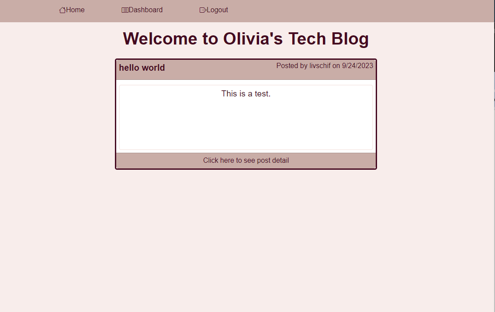

# MVC Tech Blog

 
  
  ## Table of Contents
  - [Project description](#description)
  - [Usage](#usage)
  - [Installation](#installation)
  - [Questions](#questions)
  - [License](#license)
    
  ## Description 
  I built this CMS-Style blog site where developers can publish their blog posts and comment on other developers' posts as well. This app follow the MVC paradigm in its architectural structure, using Handlebars.js as the templating language, Sequelize as the ORM, and the express-session npm package for authentication.

  ## Usage 
  HTML, CSS, Bootstrap,  Handlebars.js
  
  

  ## Installation 
  To install run a 
  
    npm i 
  
    npm start 
  
  to start up the server.

  ## Questions
  If you have any questions you can email me at [email](oliviaschif@gmail.com)
  also check out my [GitHub](https://github.com/livschif) 

  ## License
  MIT_License